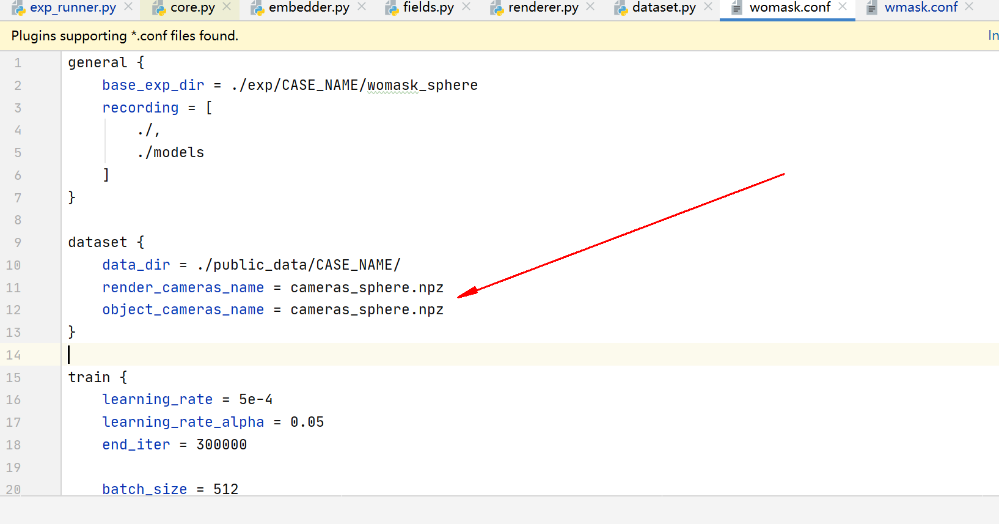
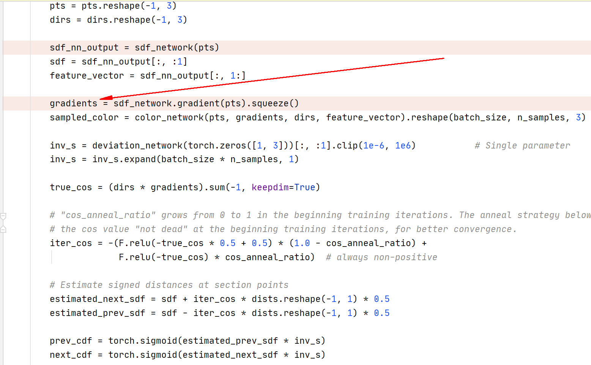
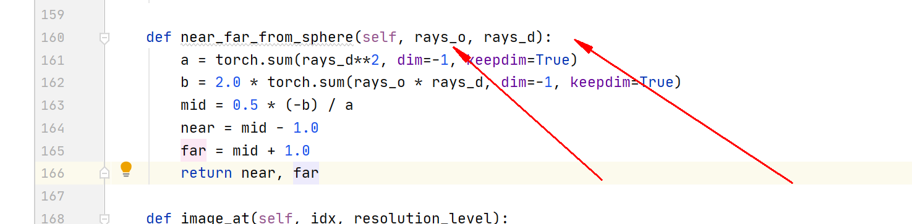
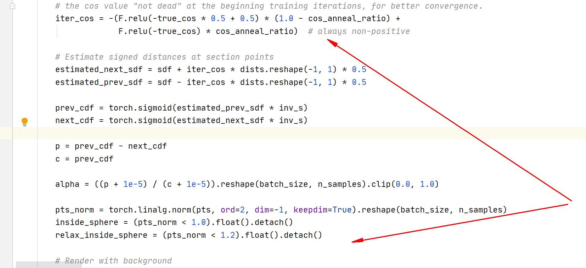

# Learning Neus

#### 训练

```
python train_net.py  --cfg_file configs/neus/neus.yaml
```

Neus复现总结

```
1、第一天，看懂Neus论文思路
2、第二天，看懂实验室的learning_nerf框架
3、梳理Neus的网络部分的关键代码
4、整合代码到实验室的learning_nerf框架上
```

1、数据集可能不怎么对，目前我数据IDR项目中下载，Neus提供的谷歌云盘数据不让下载，数据大致相同，但是相机参数这块，Neus项目中用的是cameras_sphere，IDR提供的是camera.npz和cameras_linear_init.npz,IDR介绍的是区别在于是否对相机参数进行归一化，但是Neus对数据这块并没有详细介绍，论文中只是说数据和IDR是一样的。



2、Neus代码中计算位置编码值的gradients主要用途是什么



3、Sphere-based sampling基于球体的采样，还不怎么理解，怎么通过光线的原点以及光线的方向向量



4、计算sdf值的时候，为什么还要得到sdf网络还要输出feature特征


5、这段代码还没怎么理解

